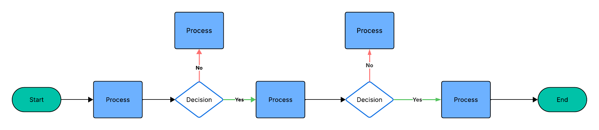

# Code Quality

Designing code that is maintainable is a struggle.  Many projects have been doomed by poor design choices, or worse - continued to limp along for years or decades when it should have been abandoned in favor of a rewrite.  Often people don't realize the cost of **technical debt** - choices made early on (often for the sake of expediency or to save a tiny bit of money now), that cost us enormous amounts of time and money later on.

As AI takes over more of the low-level programming tasks, humans will undoubtedly trend to the design-side of things.  This means we need to be able to vet code given to us by an AI (or junior programmer) and determine if it is of sufficient quality to merge into our code base.  To aid us in that endeavor are code quality metrics.

No single metric can tell you if your code is "good enough".  There are many facets of our code that we can measure, and sometimes an increase in one metric can cause a decrease in another.  As an architect of a system, you must determine what you or your organization needs.  In grad school, I had a professor who had worked for Boeing.  She used to constantly remind us that it is completely possible to build an airplane that is essentially crash-proof.  The reason we don't is that it would cost too much to do so.  As sad a statement as that is, it is largely true - given a limited set of resources we must optimize to get the most good out of them.  And we will always lack resources.

While there are a great many metrics available, we will be learning about the following:

- Cyclomatic Complexity
- Test Coverage
- Code Duplication
- Code Churn
- Technical Debt
- Maintainability Index
- Security
- Bug Rate
- Standards Compliance
- Documentation Quality

## Cycolmatic Complexity

Imagine you have a function called `my_function`.  It does something really important and novel.  In your function, you have an `if`-statement:

```python
def my_function(self):
  if some_check():
    ... run this code ...
  else:
    ... run this code instead ...
```

Looking closely at this pseudocode, we can see that there are two paths of execution through the function - either `some_check()` returns `True` and the first code block runs, or it returns `False` and the second code block runs.  This is an example of **cyclomatic comlexity** - the number of independent paths through a function.  Now, imagine that a few lines below this code there is another `if` statement check - now there are four paths through the code.  The possible paths are:

|First Path Result|Second Path Result|
|----------------|-------------------||
| `True`          | `True`           |
| `True`          | `False`          |
| `False`         | `True`           |
| `False`         | `False`          |

For every additional branch we increase the complexity - sometimes exponentially.  Complex code is hard to maintain.  As we've already talked about in this book, humans aren't great at long, complicated processes.  We just don't think that way.  As cyclomatic complexity increases, so do the number of bugs.

Calculating this type of complexity usually involves a **node-edge** graph called a **flow-graph**. {align=center w=100%}.
