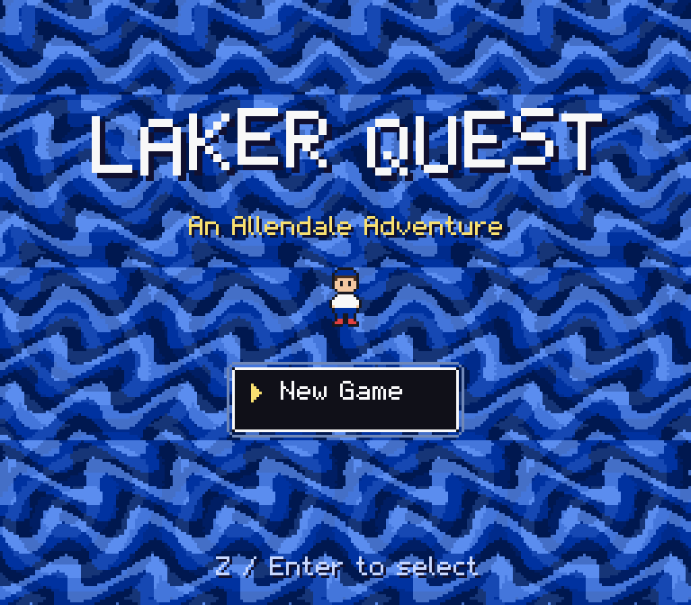
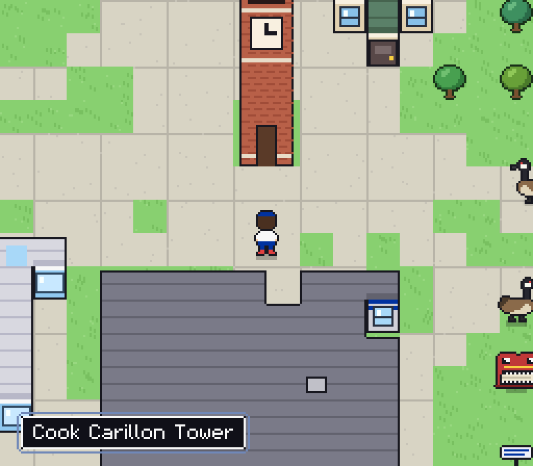
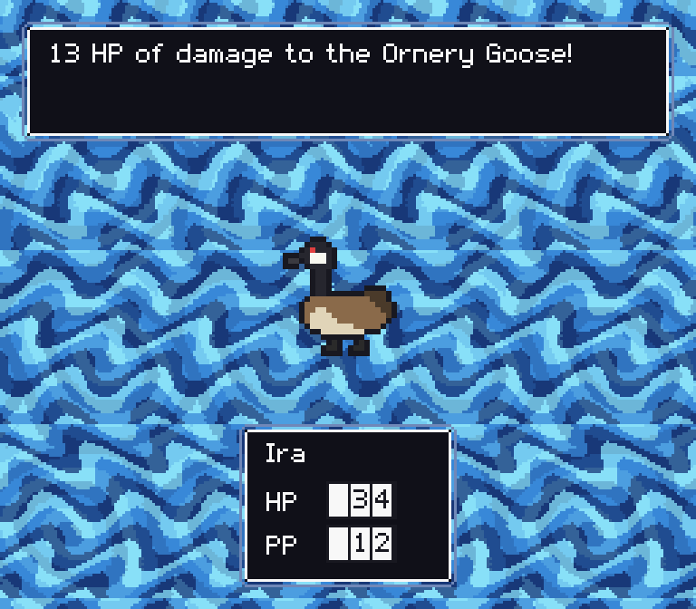
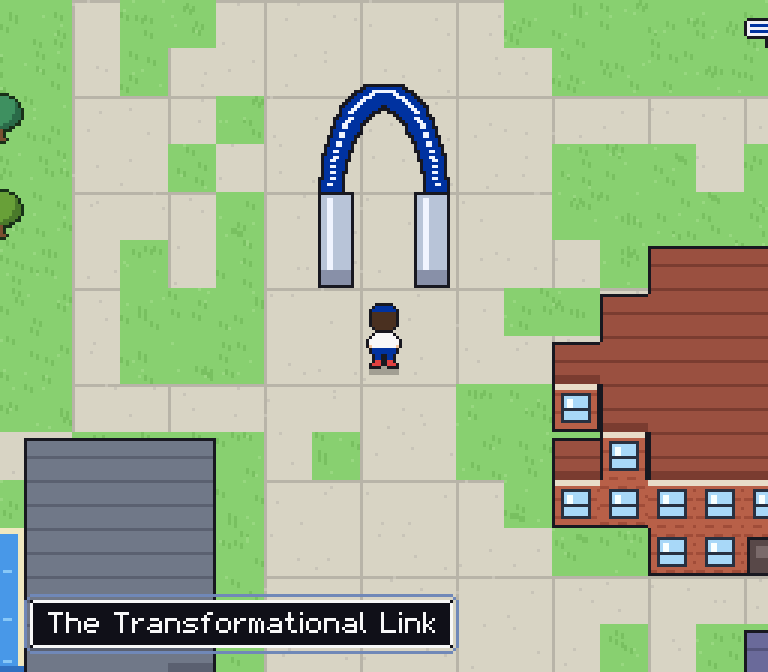

## Laker Game Labs

I love making games, and I find a lot of students do as well.  Laker Game Labs is a real-world, experiential learning way for students and myself to work together on the creation of games.  This idea came out of the realization that programming assignments often fail to teach many of the skills needed for industry.  Typical assignments are completed by individuals or small-groups of computing students; it is common in industry for large teams from diverse fields to work together on the creation of products.  The goals of Laker Game Labs are:

- to give students exposure to working on a large-scale project involving a diverse team
- gaining proficiency in build tools and version control systems
- giving students greater understand of the entire software development lifecycle
- generating excitement and enthusiasm for learning
- making games

Game programming involves some of the toughest challenges in computing.  What follows are games created by myself and by Laker Game Labs.

## Laker Quest

An Earthbound-style 16-bit RPG set on Grand Valley State University's Allendale campus. At midnight the Cook Carillon rang thirteen times, out of tune, and since then campus has been strange: squirrels pick fights, overdue books fly around the library, and the geese are worse than usual. Explore a campus built from real map data, from Lubbers Stadium and the Little Mac Bridge to the Transformational Link, take on side quests, and find out what's wrong with the tower.

{button}`Play Laker Quest <https://irawoodring.github.io/laker_quest>`

::::{grid} 1 2 2 2

:::{card}


The title screen.
:::

:::{card}


The Cook Carillon Tower, with some unfriendly locals.
:::

:::{card}


Battles, complete with a rolling HP meter.
:::

:::{card}


The Transformational Link, south of the Little Mac Bridge.
:::

::::

```{figure} images/games/laker-quest-map.png
:alt: The in-game campus map, showing buildings, parking lots, woods and the Grand River
:width: 60%
The campus map, built from OpenStreetMap data.
```

## Exit Status

A terminal-based game for learning the command line. Exit Status runs a full Linux system on emulated hardware right in your browser, and drops you at a shell with a message: you're in the system, but you aren't ready until you pass its tests. Learn `ls`, `cd`, `cat` and friends to find each level's flag and unlock the next challenge. If you break something, reload the page to start fresh; download a save state to keep your progress.

{button}`Play Exit Status <https://irawoodring.github.io/exit_status>`

% TODO: add an Exit Status screenshot, e.g.
% ```{figure} images/games/exit-status.png
% :alt: The Exit Status terminal
% ```
